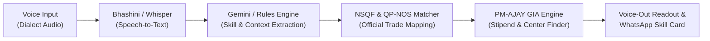

# Kaushal Sarathi (कौशल सारथी) 🇮🇳

### **AI-Driven Voice Assistant for Livelihood Mapping & NSQF-Aligned Skilling Recommendations under PM-AJAY (GIA Component)**
* **Ministry:** Ministry of Social Justice and Empowerment (MoSJE)  
* **Scheme:** Pradhan Mantri Anusuchit Jaati Abhyuday Yojana (PM-AJAY) - Grant-in-Aid (GIA) Component  
* **Target Audience:** Scheduled Caste (SC) Beneficiaries, Rural Youth, and Informal Artisans  
* **Deployment:** Live on Vercel (Frontend SPA) & Render (Backend API)  

---

## 📖 Project Overview

**Kaushal Sarathi (कौशल सारथी)** is a voice-first, vernacular AI livelihood navigator built to overcome the low-literacy and language barriers faced by underprivileged Scheduled Caste (SC) rural youth. 

Instead of forcing beneficiaries to navigate complex, text-heavy online portals, Kaushal Sarathi conducts **natural spoken conversations in local dialects** (Hindi, Tamil, Bhojpuri, etc.), maps informal craft and trade experience into official **NSQF (National Skills Qualification Framework)** qualification levels (Levels 1–5), calculates exact free legal entitlements under the **PM-AJAY Grant-in-Aid (GIA)** component (100% free course, ₹2,500/month stipend, ₹10,000 free toolkit), and matches beneficiaries to certified local jobs within a **15 km radius**.

---

## ✨ Winning Features & Innovations

1. **🎙️ Voice-First Vernacular Intake (Voice-In)**:
   * Real-time microphone speech recognition via Web Speech API and Indic dialect NLP.
   * Zero reading or form-filling required.

2. **🔊 Natural Audio Readout (Voice-Out)**:
   * Conversational voice feedback in the user's mother tongue explaining recommendations and center details aloud.

3. **🎛️ Dual-Mode Visual Icon Keypad Fallback**:
   * Audio-guided visual touch buttons (Solar Panel, Handloom, Tractor, Tailoring, Masonry) for noisy village workshops or completely non-literate candidates.

4. **📜 Official NSQF & QP-NOS Qualification Mapping**:
   * Recognizes prior practical work experience (**Recognition of Prior Learning / RPL**) and translates it into official National Qualifications Register codes (e.g., `QP-ELE/Q5801: Solar PV Installation & Water Pump Technician, NSQF Level 3`).

5. **💰 PM-AJAY GIA Grant & Entitlement Calculator**:
   * Automatically calculates legal government benefits:
     * 100% Free Course Tuition (₹14,500 – ₹18,000 waived)
     * Direct Benefit Transfer (DBT) Monthly Stipend (₹2,500 / month)
     * Free Startup Tool-Kit Grant (₹10,000 value upon certification)
     * Total Grant Value: **₹24,500 to ₹28,000**

6. **📡 Hyper-Local Demand Radar (15 km Radius)**:
   * Real-time district demand matching to prevent post-training unemployment (e.g., 45 solar water pumps installed under PM-KUSUM in Bassi block with zero certified technicians).
   * Displays nearest accredited training center, distance, and remaining seats.

7. **📱 Verifiable Digital Kaushal Card (WhatsApp Ready with QR Code)**:
   * Generates an official, beautiful digital ID with scannable cryptographic QR code for instant employer verification and Mudra micro-enterprise loans.
   * One-click "Share via WhatsApp" and "Print Card".

8. **🏛️ District Magistrate (DM) / MoSJE Livelihood Heatmap**:
   * Dedicated administrative decision-support dashboard for District Collectors and MoSJE officers showing block-level skill deficits, GIA fund absorption, and batch sanctioning.

---

## 🚀 Quick Start (1-Click Run)

### Method 1: Instant Autonomous Browser Launch (Zero Dependencies)
Simply double-click:
```bash
start.bat
```
*(Or directly open `frontend/index.html` in Chrome or Edge. All AI speech, NSQF mapping, GIA calculators, and DM heatmap run autonomously client-side!)*

### Method 2: With Full Python / FastAPI Backend
```bash
# 1. Install dependencies
pip install -r requirements.txt

# 2. Start FastAPI Server
python -m uvicorn backend.main:app --port 8000 --reload

# 3. Start Frontend
python -m http.server 3000 --directory frontend

# 4. Open in Browser
http://localhost:3000
```
Interactive API Documentation: `http://localhost:8000/docs`

---

## 🛠️ Architecture & Tech Stack



* **Frontend**: Lightweight Progressive Web App (HTML5, Tailwind CSS, JavaScript, Web Speech API, SpeechSynthesis)
* **Backend**: Python FastAPI (High-speed asynchronous REST API)
* **Database**: SQLite (Local / Offline) & PostgreSQL (Production)
* **Standards**: NSDC National Qualifications Register (NQR), MoSJE PM-AJAY GIA Guidelines

---

## 🏛️ Regulatory & Policy Compliance
* **Standard Qualification Register:** National Skills Qualification Framework (NSQF Levels 1 to 5)
* **Target Scheme:** PM-AJAY Grant-in-Aid (GIA) Component for SC Livelihoods
* **Public Data Integration:** `api.data.gov.in` (Open Government Data - OGD Platform India)
* **Speech & Dialect Engine:** Digital India Bhashini (NLTM) Voice AI Integration

